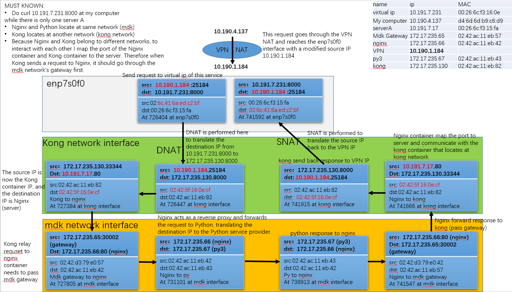

#### This document contains numerous diagrams illustrating the client request flow under various circumstances,    
#### from different devices to different devices within a network comprising various devices.   
#### These diagrams were created using different methods, such as tcpdump and the logs from docker-compose,   
####  which include Nginx. Kong. Pyhon logs. These logs indicate who made the client request,   
####  where it was forwarded to , and who the response was sent back to.     
####  The purpose of this document is to demonstrate how packet flow and how the network handles requests.    
#### These diagrams are intended to help us better understand how this project operates.     

###  Network Structure    
  This diagram shows the structure of this project, there are two server, ServerA and ServerB  
  Each server hosts a complete stack including Keepalived, Kong, Nginx, and three Python containers.  
  On both server, Kong container locates at kong network and Nginx with three Python containers locate at another network named mdk.   
  - Virtual IP: 10.191.7.231   
  - ServerA IP: 10.191.7.17  
  - ServerB IP: 10.191.7.16  
  A client sends a request to the VIP managed by Keepalived. Keepalived directs the request to one of the Kong instances (either on server A or server B). Kong processes the request and forwards it to one of the Nginx instances (either on server A or server B). Nginx balances the load and forwards the request to one of the three Python.     

    

###  Request flow while sending curl request from my computer
127.2.0.1 is an alternative loopback path and with a rule that maps localhost:8123 to VirtualIP:8000.  
        
this diagram was drawn based on docker-compose logs

    

###  Address Kong and Nginx using different servers      
    
this diagram was drawn based on  sudo tcpdump  

### Curl VirtualIP:8000 from my computer, both Kong and Nginx serving from one server       
    
this diagram was drawn based on sudo tcpdump    
      

      

   

   

 
  
      

